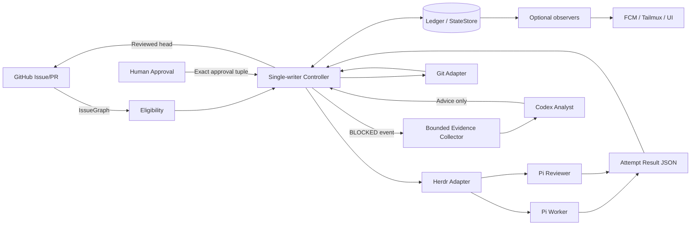
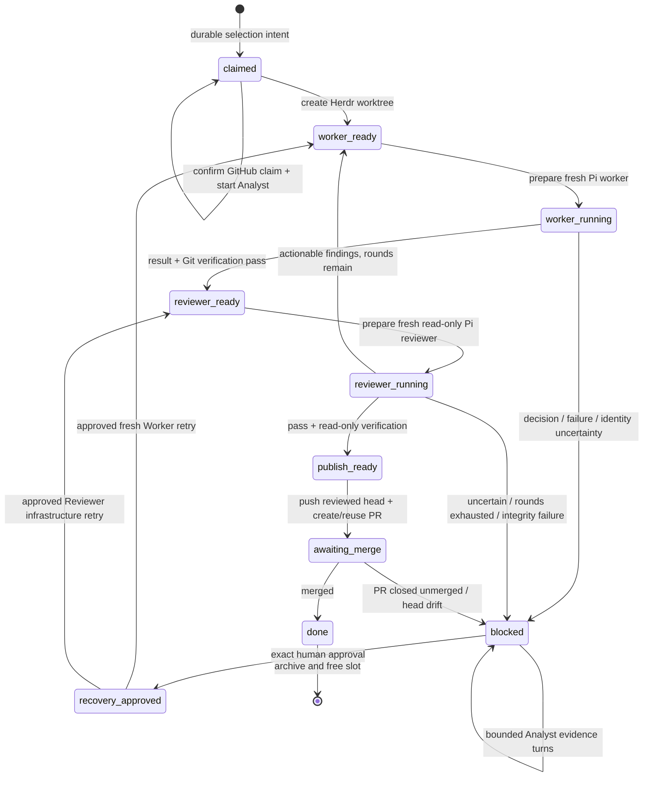
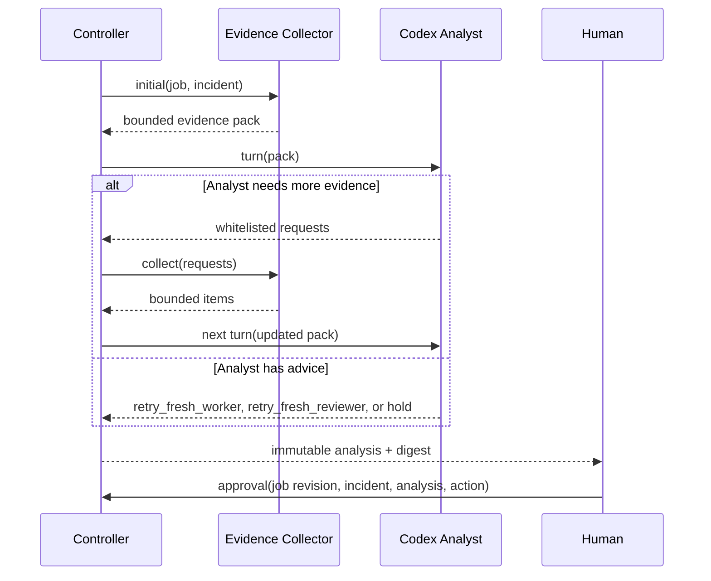

# HerdrHarness 精简架构与 Block 处理逻辑

## 1. 结论

当前项目的问题不是能力方向错误，而是**控制面、执行面、证据面、远程观察面同时进入了同一组 controller 模块**。继续在当前 `run-once / audit-once / monitor / repair / approve / push-device` 结构上增量修补，复杂度还会持续上升。

建议建立 V2 核心，保留现有项目中最有价值的五项设计：

1. 单写控制器与持久 ledger；
2. GitHub Issue Map/block 识别；
3. 每次 agent attempt 有不可变 ID 和结构化结果文件；
4. Herdr 状态只表示进程生命周期，Git 与结果文件共同决定任务是否完成；
5. block 后必须经过证据、Analyst 建议、人工审批，且恢复只能启动与获批动作匹配的 fresh Worker 或 fresh Reviewer。

以下能力移出核心：FCM、设备配对、Tailmux companion、通知、展示、低层 `repair` 命令、多个含义重叠的 `bind/work/watch/monitor` 入口。它们可以作为 observer 或 operator adapter 返回，但不能参与状态决策。

---

## 2. 第一性原理：只保留变量、关系、约束

### 2.1 变量

| 变量 | 含义 | 权威来源 |
|---|---|---|
| `IssueGraph` | Issue、Map、parent/sub-issue、blockedBy、label、state | GitHub |
| `Job` | Harness 对一个 issue 的持久执行实例 | Ledger |
| `Attempt` | 某一次 worker/reviewer 执行，具有不可变 ID | Ledger + result file |
| `Worktree` | 该 Job 的隔离代码空间与分支 | Git + Herdr |
| `Incident` | 一次不可自动继续的阻塞事实 | Harness |
| `EvidencePack` | Analyst 可见的有限、只读、带 digest 的证据 | Harness |
| `Analysis` | Codex Analyst 的建议，不是权限 | Analyst adapter |
| `Approval` | 人对一个精确 Incident/Analysis 的授权 | Human gate |
| `PullRequest` | 经 reviewer 验证的 head 的交付对象 | GitHub |

### 2.2 关系

```text
Issue 1 ── 0..N Job（V1 实际只允许未完成 Job 为 1）
Job   1 ── 1 AnalystSession
Job   1 ── N Attempt
Job   1 ── 0..1 ActiveIncident
Incident 1 ── 0..1 Analysis
Analysis 1 ── 0..1 Approval
Approval 1 ── 1 RecoveryAction
```

关键绑定关系：

```text
Approval = f(job_id, job_revision, incident_id, analysis_id, action)
```

其中任意一项变化，审批立即失效。

### 2.3 约束

1. **单写者**：只有 controller 能修改 Job；observer、Analyst、Pi、移动端都不能写状态。
2. **GitHub 决定能否领取**：OPEN、ready label、无 assignee、无 OPEN blocker。
3. **Git 决定代码事实**：branch、base/head ancestry、commit、dirty、push 状态不能由模型自报代替。
4. **Herdr 只负责运行与观察**：workspace/tab/pane/agent 生命周期不是交付验收。
5. **模型输出没有权限**：Pi/Codex 只能产出结果或建议，不能直接迁移 controller 状态。
6. **恢复不复用旧上下文**：审批后关闭旧 pane，按获批动作创建新的 Worker 或 Reviewer attempt；旧 agent 不会收到新的控制指令。
7. **不确定即停止**：stale revision、身份不一致、HEAD 变化、证据缺失、仅有未知 agent 状态时全部 fail closed；若 pane 关闭后仍有合法 result 与 Git 固定点，则交付事实可以独立收敛。

---

## 3. 当前项目为什么会变复杂

### 3.1 命令面已经代替了状态机

当前 `src/cli.ts` 同时暴露 onboarding、bind、run、audit、publish、wait、work、watch、monitor、status、diagnose、repair、approve、cancel、push-device 等入口。每个入口都需要重新判断 ledger、锁、Git、Herdr、Analyst 的状态，导致“同一状态由多个命令解释”。

精简后只保留：

```text
run / tick     controller 唯一推进入口
status         只读
approve        唯一恢复授权入口
cancel         可选的显式终止入口
```

### 3.2 `run-once` 和 `audit-once` 承担了过多横切责任

当前执行模块同时处理：配置、锁、SQLite、项目归属、Git 固定点、Herdr pane、prompt dispatch、结果文件、Codex Analyst、intervention、恢复 brief、revision CAS。审计模块又重复一遍相似流程，并额外承担 review/rework 循环。

问题不是文件数量，而是**领域规则与 CLI/Herdr/Git/Analyst 细节没有隔离**。任何一项能力变化，都会影响多个阶段。

### 3.3 重复实现 Herdr 已有的 agent 生命周期

当前 runtime 在创建 worktree 后，自行执行：

```text
pane list
-> 找 shell pane
-> pane split
-> pane run Pi
-> 轮询等待 agent 被识别
-> prompt
-> 再轮询状态
```

这会把 Herdr 的内部识别行为变成 Harness 的业务依赖。精简适配器改为：

```text
herdr worktree create
herdr tab list / pane list（恢复未落账的自有 pane）
herdr tab create
herdr agent start --kind pi
herdr agent prompt --wait
herdr agent wait
herdr agent get / read（wait 失败或 blocked 时只读诊断）
herdr pane close（成功验收后）
```

Harness 只记录 Herdr 返回的 workspace/pane/agent identity。

### 3.4 Map 前沿语义不完全一致

当前 Map 逻辑对不同阻塞形式采用了不同策略：首个 OPEN child 没有 ready 标签时会停止 Map；但 child 已有 ready 标签、同时存在 blocker 或 assignee 时，会继续寻找后续 child。这样会出现“有些阻塞禁止越过，有些阻塞允许越过”的不稳定顺序语义。

V2 使用严格规则：**第一个 OPEN child 就是唯一 frontier；它不可执行时，整个 Map 等待，绝不越过。**

### 3.5 Analyst 与审批安全性较好，但与观察/推送耦合

当前 Codex Analyst 已经具备 restricted profile、只读 sandbox、固定 session handle、reserve-before-launch 和 fail-closed；`approve.ts` 也会重新读取精确 analysis，再委派给唯一 `repair` seam；`repair.ts` 会核对 revision、Incident、pane 和项目来源，并清除旧 agent provenance。**这些安全设计应保留。**

真正的问题是 Analyst lifecycle、本地 monitor、远端 diagnose、Tailmux approval、FCM push、device pairing 都围绕同一 blocked job 继续增长，甚至 Analyst 模块直接依赖 push delivery。它们应拆为：

```text
Core: Incident -> Evidence -> Analysis -> Approval -> Recovery
Observer: status/notification/mobile display
Adapter: Codex session、FCM、Tailmux transport
```

Observer 可以丢失，Core 不可丢失；Observer 不能拥有状态迁移权限。

---

## 4. 目标架构



### 4.1 责任边界

| 组件 | 负责 | 不负责 |
|---|---|---|
| GitHub adapter | Issue graph、claim label、PR、merge observation | agent 生命周期、恢复决策 |
| Eligibility | 纯 Map/block/ready 计算 | GitHub mutation、ledger write |
| Controller | 唯一状态迁移、effect 调用、CAS | 模型推理、UI、通知 |
| Herdr adapter | worktree/tab/agent start/prompt/wait/close | 任务完成判定 |
| Pi worker | 修改、验证、提交 | push、PR、审批、controller write |
| Pi reviewer | 独立只读审查 | 修改代码、复用 worker 结论 |
| Git adapter | SHA、ancestry、branch、dirty、push 验真 | 任务语义判断 |
| Codex Analyst | 证据分析、提出 bounded resolution brief | shell recovery、状态迁移、审批 |
| Human gate | 对精确建议授权 | 任意跳转状态、向旧 agent 注入命令 |
| Observer | 展示、通知 | 任何写操作 |

---

## 5. 状态机



每个 `tick` 最多完成一次持久状态迁移。外部调用失败时，不假设成功；下一轮根据 ledger 和外部身份重新协调。

每个 attempt 还具有内部阶段：

```text
prepared -> pane_ready -> agent_ready -> running -> settled
```

pane identity 与 agent identity 分阶段落账；`running` 在 prompt 前落账，因此 prompt 返回丢失或进程崩溃都不会触发同一 dispatch 重放。成功结果经 Git 验证后关闭该 attempt 自有 pane；若关闭后、状态保存前崩溃，下一轮允许用 durable result 继续验收，并把 `pane_not_found` 视为幂等关闭。blocked、failed 或不确定的 pane 留到精确人工恢复时再关闭。本阶段不自动删除 worktree。

---

## 6. Issue、Map 与 Block 领取逻辑

### 6.1 Standalone Issue

只有同时满足以下条件才可领取：

```text
state == OPEN
AND labels contains ready-for-agent
AND assignees is empty
AND blockedBy has no OPEN issue
AND issue not in durable ledger/history
AND issue is not a Map
AND issue is not a child of a Map
```

### 6.2 Map

Map 是容器，不是执行任务：

```text
Map 必须 OPEN + ready-for-agent
找到 subIssues 中第一个 state == OPEN 的 child
仅检查这个 child
```

该 child 必须：

```text
OPEN
+ ready-for-agent
+ no assignee
+ no OPEN blocker
+ parent 唯一且等于该 Map
+ 自身不是 Map
+ 不在 ledger
```

如果该 child 不满足，Map 等待；不能领取后续 child。

### 6.3 领取过程

```text
1. 纯选择，写入 durable claim intent
2. 再读取 GitHub frontier
3. 目标、updatedAt、Map 关系一致
4. 将 ready-for-agent 替换为 agent:claimed
5. 启动 task-bound Analyst
6. claimConfirmed=true
```

先写 claim intent，再改 GitHub label，因此即便在 label mutation 后崩溃，重启也能通过 ledger + `agent:claimed` 恢复，不会重复领取其他任务。

V1 明确约束为单 controller。未来如需多机器并发，claim 必须升级为 GitHub Project 字段或外部租约 CAS，不能只依赖通用 label。

---

## 7. Block 分类与处理逻辑

### 7.1 入队 Block 与运行时 Block 必须分开

#### A. GitHub dependency block

Issue 的 `blockedBy` 中存在 OPEN issue：

```text
不领取
不创建 Job
不启动 Analyst
不产生 Incident
```

它只是队列不可执行，不是 Harness 故障。

#### B. Runtime block

Job 已领取后发生不可自动继续的事件：

```text
创建 Incident
冻结当前 attempt
收集证据
调用该 Job 已绑定的 Analyst
等待人工 gate
```

### 7.2 分类矩阵

| BlockClass | 示例 | Analyst 可建议 retry | 人可批准 retry | 默认处理 |
|---|---|---:|---:|---|
| `agent_decision` | worker 明确需要业务选择 | 是 | 是 | 证据 + gate |
| `agent_blocked` | agent 失败、无有效完成结果 | 是 | 是 | 证据 + fresh worker |
| `review_uncertain` | reviewer 证据不足、轮次耗尽 | 是 | 是 | 证据 + gate |
| `infrastructure_exhausted` | Herdr dispatch/wait 无法确认 | 是 | 是 | Worker 事故重启 fresh Worker；Reviewer 事故复核同一 HEAD 后重启 fresh Reviewer |
| `integrity_violation` | SHA/branch/dirty/push/身份不一致 | 否 | 否 | hold，人工检查环境 |
| `stale_task` | Issue/Map frontier/目标已变化 | 否 | 否 | 重新选择，不复用旧任务 |
| `analyst_unavailable` | task-bound Analyst 未成功绑定 | 否 | 否 | hold/cancel |

模型即使对 `integrity_violation` 返回 retry，Harness 也会强制降级为 hold。

### 7.3 Block 状态内的证据循环



Analyst 只能请求：

```text
issue_context
attempt_result
git_status
git_diff
test_output
file_excerpt
```

Harness 负责路径限制、长度限制和读取；Analyst 不能提交 shell 命令。

### 7.4 人工 Gate

批准请求必须精确匹配：

```text
expected_revision
incident_id
analysis_id
analysis.action 是 retry_fresh_worker 或 retry_fresh_reviewer
incident.allowedActions includes analysis.action
actor
reason
```

批准只把状态变为 `recovery_approved`。真正恢复由下一次 controller tick 执行：

```text
重新校验 approval binding
-> close old pane
-> consume approval
-> clear active incident
-> retry_fresh_worker: copy bounded resolutionBrief, state=worker_ready
-> retry_fresh_reviewer: 复核同一 HEAD 与 clean tree, state=reviewer_ready
-> create a brand-new attempt ID and Pi agent
```

明确禁止：

```text
向旧 blocked pane 继续 prompt
直接修改 ledger 为 implementing
执行 Analyst 给出的任意命令
绕过 Git 固定点
把底层 repair seam 暴露为可随意选择恢复阶段的常规入口
```

---

## 8. Worker 与 Reviewer 逻辑

### 8.1 Worker

Worker 使用 Pi，拥有 worktree 写权限，但必须遵守：

```text
dispatch 强制从 /skill:implement 开始
显式加载 Matt Pocock implement、tdd 与 Harness code-review
只处理一个 issue
不 push
不创建 PR
运行验证
提交 implementation checkpoint 后执行双轴 code-review 自审
提交改动
写入 exact attempt result JSON
```

Harness 接受完成需要同时满足：

```text
result.jobId / attemptId / lane 正确
status == completed
reported head == worktree HEAD
attempt base 是 head 祖先
至少一个新 commit
branch 未变化
tracked worktree clean
远端尚无该 branch
```

### 8.2 Reviewer

每轮 reviewer 都是 fresh Pi agent，且只读：

```text
dispatch 强制从 /skill:code-review 开始
在当前 turn 内用 pi-subagents 前台并行检查 Standards 与 Spec
两个 child 均为 fresh、无写工具、无 skills、无递归 subagent
reviewedHeadSha == 当前 head
review 后 HEAD 不变
tracked worktree clean
除该 Job 已知 result JSON 外没有 untracked 文件
```

Herdr 只管理顶层 Worker/Reviewer Pi。子审查器由顶层 Pi 在同一 foreground turn 内拥有；它们继承父 Pi 的工作目录、环境和未覆写模型，但 `thinking=high` 显式固定，工具、skills、扩展和递归深度按只读职责收窄。禁止 async child，避免顶层 Pi 提前完成而留下未被 Harness 生命周期覆盖的后台执行。

Controller 直接校验原生 role argv：解析每个 `SKILL.md` 的真实 `name`，用 installer `.skill-lock.json` 核对 Matt Pocock `implement/tdd` 来源，并要求 bundled `code-review` 是唯一同名 skill；精确工具集合与 `thinking=high` 缺一不可。除可选 `provider/model/no-session` 外，extension、system prompt、session 复用和 positional prompt 等参数全部拒绝。因此 fresh attempt 不能被路径伪装或配置降级，且没有引入另一套 profile DSL。

结果：

- `pass`：进入 publish；
- `changes` 且 findings 可执行、轮次未耗尽：创建 fresh worker；
- `changes` 无 findings：block；
- `blocked/failed`：block；
- 超出 `maxReviewRounds`：block。

普通 review rework 不需要人工审批，因为它属于预定义质量闭环；只有不确定或轮次耗尽才进入 Incident。

---

## 9. 如何吸收 Herdr 与 Orca，而不是复制它们

### 9.1 从 Herdr 吸收

- 原生 worktree workspace；
- 每个 attempt 一个 tab/pane/agent；
- `agent start / prompt --wait / wait / get / read / pane close`；
- agent status 作为生命周期观测；
- JSON identity 作为外部句柄。

不让 Herdr承担：Job ledger、Map 语义、审核通过、审批权限、PR 验收。

### 9.2 从 Orca 吸收

- 一个任务一个隔离 worktree；
- worker 与 reviewer 角色分离；
- Git/GitHub 是交付主线；
- 阶段门明确，失败不隐式越过；
- agent orchestration 是可观察的流程，不是黑盒聊天。

不复制 Orca 的完整 UI、终端产品形态或全部后台服务。Herdr 已经提供本地交互与 pane 管理，Harness 只需补齐任务治理和证据 gate。

### 9.3 三层关系

```text
Orca 提供编排思想
Herdr 提供本地执行原语
Harness 提供任务治理、证据与权限边界
```

---

## 10. 精简代码结构

```text
Domain
  model.ts
  eligibility.ts
  policy.ts
  prompts.ts

Application
  controller.ts
  recovery.ts

Ports
  ports.ts

Adapters
  github-gh.ts
  git-cli.ts
  herdr-cli.ts
  json-command-analyst.ts
  local-evidence.ts
  json-store.ts

Entry
  cli.ts
```

核心模块不能导入 `gh`、`git`、Herdr CLI 或 Codex CLI；只能依赖端口。通知与移动端只能订阅 ledger/event，不进入 controller。

---

## 11. 现有代码迁移映射

| 当前模块/能力 | V2 处理 |
|---|---|
| `picker.ts` | 规则收敛到纯 `eligibility.ts`；采用严格 Map frontier |
| `bind.ts` | 并入 controller 的 durable selection/claim 两阶段 |
| `work.ts` | 只保留状态 dispatcher，命令面合并为 `run/tick` |
| `run-once.ts` | worker stage 迁入 controller；Git/Herdr/Analyst 通过 port |
| `audit-once.ts` | reviewer stage；删除与 worker 重复的启动、等待、锁代码 |
| `runtime.ts` | 收敛为薄 `herdr-cli.ts`，使用原生 agent 命令 |
| `orchestrator.ts` | attempt identity/result contract 保留；不再包办状态机 |
| `ledger.ts` | 推荐保留 SQLite，实现 `StateStore` 接口 |
| `codex-analyst.ts` | 保留为 `AnalystPort` adapter；不被 run/audit 直接导入 |
| `diagnose/monitor` | 变为 observer 或 analyst transport，不迁移状态 |
| `approve.ts` | 保留“精确 analysis 再校验”的思想，收敛为唯一 `approveRecovery` gate |
| `repair.ts` | 其 revision/Incident/pane 复核逻辑保留为内部 RecoveryService；从常规命令面隐藏并收窄为审批允许的动作 |
| `push-device/FCM/pairing` | 独立 notification plugin，仅读 event stream |
| `watch.ts` | `run` 循环；每次调用同一个 `tick` |
| `publish/wait-merge` | 保留为轻量 GitHub adapter stage |

迁移时不要一次性重写全部：先用新 controller 驱动 fake adapters，通过行为测试；再依次接入现有 SQLite、GitHub、Herdr、Pi、Codex；最后迁移通知与远程展示。

---

## 12. 参考实现验证结果

执行：

```bash
npm run verify
```

结果：

```text
TypeScript strict typecheck: PASS
Tests: 45 passed, 0 failed
```

覆盖：

1. Map 严格 frontier；
2. OPEN/ready/assignee/blocker；
3. 已领取 issue 去重；
4. claim label mutation 后崩溃恢复；
5. worker + reviewer + PR + merge；
6. reviewer findings -> fresh worker -> fresh reviewer；
7. block -> 证据请求 -> Analyst 建议；
8. stale approval 拒绝；
9. integrity block 强制 hold；
10. approval 后关闭旧 agent、创建新 attempt；
11. Herdr 0.8 原生命令、响应 identity、错误分类与 pane-ready 竞态，不使用 `pane run` 模拟 agent；
12. prompt at-most-once、关闭后崩溃恢复、成功 pane 关闭与官方 `agent get/read` 诊断。
13. Worker/Reviewer 强制 skill dispatch、Pi package 资源、fail-fast role argv、foreground 双轴 child reviewer 与 untracked 文件 gate。

真实验证：在 `Notyet1307/harness-sandbox@fd9defa` 上，以 Herdr 0.8.0、Pi 0.83.0、Pi integration v8 完成独立命名 session canary；Pi 到达 `done`、写出预期 durable result、tracked tree 未改，自有 attempt pane 关闭后已从 workspace 消失。另以 issue #12 从基线 `b0fd0b0` 运行角色 canary：强制 `implement` 的 Worker 生成本地 `1285f52` 并完成 `2/2` foreground 双轴自审，fresh Reviewer 再完成独立 `2/2` 双轴审查并返回 `pass`；两条结果均绑定精确 SHA，四条指定验证退出 0，两个自有 pane 已关闭，worktree clean，分支未 push。

完整 controller 随后以 issue #14 做了真实端到端 canary。第一次运行因 Reviewer 的 `.pi-subagents` 产物进入 worktree 而 fail closed；产物目录与 gate 绑定修复后，从 `fd9defa` 重跑，Worker 生成 `b0c0f7e`，fresh Reviewer 对同一 SHA 返回 `pass`，Controller 发布 PR #15、观察到 merge commit `7454feb`，再迁移到 `done` 并归档；Codex Analyst receipt 最终为 `closed`。最终 tracked tree clean，仅保留该 Job 已知的 `.harness` result JSON。GitHub issue、claim、Analyst、Herdr worktree、Worker、Reviewer、PR、merge observation 与 archive 的完整主链路已经验收。

限制：worktree 自动删除明确不在本阶段范围内。代码已经将该缺口隔离在 adapter 生命周期之外，不影响本次 controller 主链路结论。

---

## 13. 推荐落地顺序

### 阶段一：冻结现有 main

只修严重 bug，不再添加 observer、推送或新 repair 分支。

### 阶段二：引入 V2 Core

把本参考实现放到新分支或 `packages/harness-core-v2`，保持现有生产链不变，先运行测试。

### 阶段三：接真实适配器

顺序固定：

```text
SQLite StateStore
-> GitHubGh
-> GitCli
-> HerdrCli
-> Pi worker/reviewer 原生 argv、强制 skill dispatch 与 foreground subagents
-> existing Codex Analyst adapter
```

每接一个 adapter，就用一个真实 sandbox issue 验证，不同时迁多个边界。

### 阶段四：影子运行

V1 负责实际领取，V2 只读计算 next action；对比 20 个轮询周期或若干真实 issue，确认选择和状态一致。

### 阶段五：切换领取权

V2 获得 `agent:claimed` mutation 权；V1 只保留只读 status。稳定后再把 FCM/Tailmux 订阅到 V2 event stream。

---

## 14. 最终判断

目标不应是“做一个功能很多的 AgentOps 平台”，而应是：

```text
一个 GitHub Issue
一个隔离 worktree
一个 task-bound Analyst
一系列不可变 worker/reviewer attempts
一个单写 ledger
一个精确的人工恢复 gate
```

只要这六个对象及其关系保持清晰，未来增加多仓库、多 worker slot、不同 agent provider、移动端观察或通知，都只会增加 adapter，不会再次污染核心状态机。
